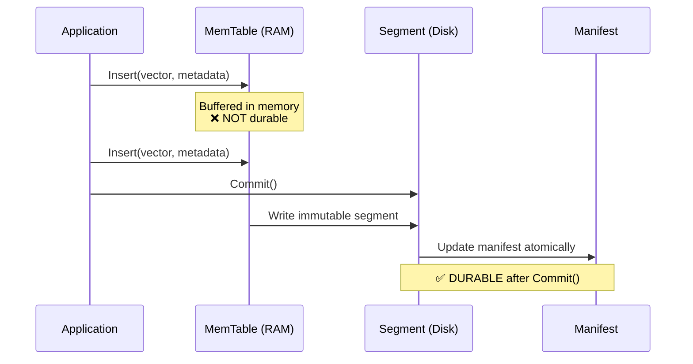

# 🧬🔍 Vecgo


[](https://pkg.go.dev/github.com/hupe1980/vecgo)
[](https://goreportcard.com/report/github.com/hupe1980/vecgo)
[](https://opensource.org/licenses/Apache-2.0)

**Vecgo** is a **pure Go, embeddable, hybrid vector database** designed for high-performance production workloads. It combines commit-oriented durability with [HNSW](https://arxiv.org/abs/1603.09320) + [DiskANN](https://papers.nips.cc/paper/2019/hash/09853c7fb1d3f8ee67a61b6bf4a7f8e6-Abstract.html) indexing for best-in-class performance.

⚠️ This is experimental and subject to breaking changes.

## ✨ Key Differentiators

- ⚡ **Faster & lighter than external services** — no network overhead, no sidecar, 15MB binary
- 🔧 **More capable than simple libraries** — durability, MVCC, hybrid search, cloud storage
- 🎯 **Simpler than CGO wrappers** — pure Go toolchain, static binaries, cross-compilation
- 🏗️ **Modern architecture** — commit-oriented durability (append-only versioned commits), no WAL complexity

## 📊 Performance

Vecgo is optimized for high-throughput, low-latency vector search with:
- **FilterCursor** — zero-allocation push-based iteration
- **Zero-Copy Vectors** — direct access to mmap'd memory
- **SIMD Distance** — AVX-512/AVX2/NEON/SVE2 runtime detection

Run benchmarks locally to see performance on your hardware:

```bash
cd benchmark_test && go test -bench=. -benchmem -timeout=15m
```

> See [benchmark_test/baseline.txt](benchmark_test/baseline.txt) for reference results.

## 🎯 Features

### 📊 Index Types

| Index | Description | Use Case |
|-------|-------------|----------|
| **[HNSW](https://arxiv.org/abs/1603.09320)** | Hierarchical Navigable Small World graph | In-memory L0 (16-way sharded, lock-free search, arena allocator) |
| **[DiskANN/Vamana](https://papers.nips.cc/paper/2019/hash/09853c7fb1d3f8ee67a61b6bf4a7f8e6-Abstract.html)** | Disk-resident graph with quantization | Large-scale on-disk segments with PQ/RaBitQ |
| **[FreshDiskANN](https://dl.acm.org/doi/10.1145/3448016.3457550)** | Streaming updates for Vamana | Lock-free reads, soft deletion, background consolidation |
| **Flat** | Exact nearest-neighbor with SIMD | Exact search, small segments |

### 🗜️ Quantization

Quantization reduces **in-memory index size** for DiskANN segments. Full vectors remain on disk for reranking.

| Method | RAM Reduction | Recall | Best For |
|--------|---------------|--------|----------|
| **[Product Quantization (PQ)](https://hal.inria.fr/inria-00514462v2/document)** | 8-64× | 90-95% | Large-scale, high compression |
| **[Optimized PQ (OPQ)](https://www.microsoft.com/en-us/research/publication/optimized-product-quantization-for-approximate-nearest-neighbor-search/)** | 8-64× | 93-97% | Best recall with compression |
| **Scalar Quantization (SQ8)** | 4× | 95-99% | General purpose, balanced |
| **Binary Quantization (BQ)** | 32× | 70-85% | Pre-filtering, coarse search |
| **[RaBitQ](https://arxiv.org/abs/2405.12497)** | ~30× | 80-90% | Better BQ alternative (SIGMOD '24) |
| **INT4** | 8× | 90-95% | Memory-constrained |

> 📖 See [Performance Tuning Guide](docs/tuning.md#quantization) for detailed quantization configuration.

### 🏢 Enterprise Features

- ☁️ **Cloud-Native Storage** — S3/GCS/Azure via pluggable BlobStore interface
- 🔒 **Commit-Oriented Durability** — Atomic commits with immutable segments
- 🔀 **[Hybrid Search](https://plg.uwaterloo.ca/~gvcormac/cormacksigir09-rrf.pdf)** — BM25 + vector similarity with RRF fusion
- 📸 **Snapshot Isolation** — Lock-free reads via MVCC
- ⏰ **Time-Travel Queries** — `WithTimestamp()` / `WithVersion()` to query historical state
- 🏷️ **Typed Metadata** — Schema-enforced metadata with filtering
- 📊 **Query Statistics** — `WithStats()` + `Explain()` for debugging
- 🎯 **Segment Pruning** — Triangle inequality, Bloom filters, numeric range stats
- 🚀 **SIMD Optimized** — AVX-512/AVX2/NEON/SVE2 runtime detection

## 🚀 Quick Start

### 📦 Installation

```bash
go get github.com/hupe1980/vecgo
```

**Platform Requirements:** Vecgo requires a **64-bit** architecture (amd64 or arm64). SIMD optimizations use AVX-512/AVX2 on x86-64 and NEON/SVE2 on ARM64.

### 💻 Basic Usage

```go
package main

import (
    "context"
    "fmt"
    "log"

    "github.com/hupe1980/vecgo"
    "github.com/hupe1980/vecgo/metadata"
)

func main() {
    ctx := context.Background()

    // Create a new index (128 dimensions, L2 distance)
    db, err := vecgo.Open(ctx, vecgo.Local("./data"), vecgo.Create(128, vecgo.MetricL2))
    if err != nil {
        log.Fatal(err)
    }
    defer db.Close()

    // Insert with fluent builder API
    vector := make([]float32, 128)
    rec := vecgo.NewRecord(vector).
        WithMetadata("category", metadata.String("electronics")).
        WithMetadata("price", metadata.Float(99.99)).
        WithPayload([]byte(`{"desc": "Product description"}`)).
        Build()
    
    id, err := db.InsertRecord(ctx, rec)
    if err != nil {
        log.Fatal(err)
    }
    fmt.Printf("Inserted ID: %d\n", id)

    // Or use the simple API
    id, err = db.Insert(ctx, vector, nil, nil)

    // Commit to disk (data is durable after this)
    if err := db.Commit(ctx); err != nil {
        log.Fatal(err)
    }

    // Search — returns IDs, scores, metadata, and payload by default
    query := make([]float32, 128)
    results, err := db.Search(ctx, query, 10)
    if err != nil {
        log.Fatal(err)
    }

    for _, r := range results {
        fmt.Printf("ID: %d, Score: %.4f\n", r.ID, r.Score)
    }

    // High-throughput mode (IDs + scores only)
    results, _ = db.Search(ctx, query, 10, vecgo.WithoutData())
}
```

### 🔄 Re-open Existing Index

```go
// Dimension and metric are auto-loaded from manifest
db, err := vecgo.Open(ctx, vecgo.Local("./data"))
```

### ☁️ Cloud Storage (Writer/Reader Separation)

```go
import (
    "github.com/hupe1980/vecgo"
    "github.com/hupe1980/vecgo/blobstore/s3"
)

// === Writer Node (build index locally, then sync to S3) ===
db, _ := vecgo.Open(ctx, vecgo.Local("/data/vecgo"), vecgo.Create(128, vecgo.MetricL2))
db.Insert(ctx, vector, nil, nil)
db.Close()
// Sync: aws s3 sync /data/vecgo s3://my-bucket/vecgo/

// === Reader Nodes (stateless, horizontally scalable) ===
store, _ := s3.New(ctx, "my-bucket", s3.WithPrefix("vecgo/"))

// Remote() is automatically read-only
db, err := vecgo.Open(ctx, vecgo.Remote(store))

// Writes return ErrReadOnly
_, err = db.Insert(ctx, vec, nil, nil)  // err == vecgo.ErrReadOnly

// With explicit cache directory for faster repeated queries
db, err := vecgo.Open(ctx, vecgo.Remote(store),
    vecgo.WithCacheDir("/fast/nvme"),
    vecgo.WithBlockCacheSize(4 << 30),  // 4GB
)
```

### 🔍 Filtered Search

```go
// Define schema for type safety
schema := metadata.Schema{
    "category": metadata.FieldTypeString,
    "price":    metadata.FieldTypeFloat,
}

db, _ := vecgo.Open(ctx, vecgo.Local("./data"),
    vecgo.Create(128, vecgo.MetricL2),
    vecgo.WithSchema(schema),
)

// Search with filter
filter := metadata.NewFilterSet(
    metadata.Filter{Key: "category", Operator: metadata.OpEqual, Value: metadata.String("electronics")},
    metadata.Filter{Key: "price", Operator: metadata.OpLessThan, Value: metadata.Float(100.0)},
)

results, _ := db.Search(ctx, query, 10, vecgo.WithFilter(filter))
```

### 🔀 Hybrid Search (Vector + BM25)

```go
// Insert with text for BM25 indexing
doc := metadata.Document{
    "text": metadata.String("machine learning neural networks"),
}
db.Insert(ctx, vector, doc, nil)

// Hybrid search with RRF fusion
results, _ := db.HybridSearch(ctx, vector, "neural networks", 10)
```

### ⏰ Time-Travel Queries

Query historical snapshots without affecting the current state:

```go
// Open at a specific point in time
yesterday := time.Now().Add(-24 * time.Hour)
db, _ := vecgo.Open(ctx, vecgo.Local("./data"), vecgo.WithTimestamp(yesterday))

// Or open at a specific version ID
db, _ := vecgo.Open(ctx, vecgo.Local("./data"), vecgo.WithVersion(42))

// Query as if it were that moment in time
results, _ := db.Search(ctx, query, 10)
```

**How it works:**
- Old manifests are preserved (each points to immutable segments)
- Compaction still runs — creates NEW optimized segments
- Old segments retained until `Vacuum()` removes expired manifests
- Storage: `~current_data × (1 + retained_versions × churn_rate)`

**Use cases:**
- 🔍 Debug production issues: "What did the index look like before the bad deployment?"
- 📊 A/B testing: Compare recall against historical versions
- 🔄 Recovery: Roll back to a known-good state

**Managing retention:**
```go
// Configure retention policy
policy := vecgo.RetentionPolicy{KeepVersions: 10}
db, _ := vecgo.Open(ctx, vecgo.Local("./data"), vecgo.WithRetentionPolicy(policy))

// Reclaim disk space from expired versions
db.Vacuum(ctx)
```

### 📊 Query Statistics & Explain

Understand query execution for debugging and optimization:

```go
var stats vecgo.QueryStats
results, _ := db.Search(ctx, query, 10, vecgo.WithStats(&stats))

// Summary explanation
fmt.Println(stats.Explain())
// Output: "searched 3 segments (1 pruned by stats, 0 by bloom), 
//          scanned 1200 vectors in 2.1ms, recalled 847 candidates (0.7 hit rate)"

// Detailed statistics
fmt.Printf("Segments searched: %d\n", stats.SegmentsSearched)
fmt.Printf("Segments pruned (stats): %d\n", stats.SegmentsPrunedByStats)
fmt.Printf("Segments pruned (bloom): %d\n", stats.SegmentsPrunedByBloom)
fmt.Printf("Vectors scanned: %d\n", stats.VectorsScanned)
fmt.Printf("Candidates recalled: %d\n", stats.CandidatesRecalled)
fmt.Printf("Latency: %v\n", stats.Latency)
fmt.Printf("Graph hops: %d\n", stats.GraphHops)
fmt.Printf("Cost estimate: %.2f\n", stats.CostEstimate())
```

### 🎯 Segment Pruning & Manifest Stats

Vecgo automatically prunes irrelevant segments using advanced statistics:

| Pruning Strategy | Description |
|------------------|-------------|
| **Triangle Inequality** | Skip segments where `|query - centroid| > radius + threshold` |
| **Bloom Filters** | Skip segments missing required categorical values |
| **Numeric Range Stats** | Skip segments with min/max outside filter range |
| **Categorical Cardinality** | Prioritize high-entropy segments for broad queries |

These statistics are automatically computed during `Commit()` and stored in the manifest (v3 format).

```go
// Get current statistics
dbStats := db.Stats()
fmt.Printf("Manifest version: %d\n", dbStats.ManifestID)
fmt.Printf("Total vectors: %d\n", dbStats.TotalVectors)
fmt.Printf("Segment count: %d\n", dbStats.SegmentCount)
```

### 📦 Insert Modes

Vecgo offers three insert modes optimized for different workloads:

| Mode | Method | Searchable | Best For |
|------|--------|------------|----------|
| **Single** | `Insert()` | ✅ Immediately | Real-time updates |
| **Batch** | `BatchInsert()` | ✅ Immediately | Medium batches (10-100) |
| **Deferred** | `BatchInsertDeferred()` | ❌ After flush | Bulk loading |

```go
// 1. SINGLE INSERT — Real-time updates (HNSW-indexed immediately)
//    Use when: you need vectors searchable immediately
id, err := db.Insert(ctx, vector, metadata, payload)

// 2. BATCH INSERT — Indexed batch (HNSW-indexed immediately)
//    Use when: you have medium batches and need immediate search
ids, err := db.BatchInsert(ctx, vectors, metadatas, payloads)

// 3. DEFERRED INSERT — Bulk loading (NO HNSW indexing)
//    Use when: you're bulk loading and don't need immediate search
//    Vectors become searchable after Commit() triggers flush
ids, err := db.BatchInsertDeferred(ctx, vectors, metadatas, payloads)
db.Commit(ctx) // Flush to disk, now searchable via DiskANN
```

**When to use Deferred mode:**
- Initial data loading (embeddings from a corpus)
- Periodic bulk updates (nightly reindex)
- Migration from another database

**When NOT to use Deferred mode:**
- Real-time RAG (documents must be searchable immediately)
- Interactive applications with instant feedback

```go
// Batch delete
err = db.BatchDelete(ctx, ids)
```

## 💾 Durability Model

Vecgo uses **commit-oriented durability** — append-only versioned commits:



| State | Survives Crash? |
|-------|-----------------|
| After `Insert()`, before `Commit()` | ❌ No |
| After `Commit()` | ✅ Yes |
| After `Close()` | ✅ Yes (auto-commits pending) |

**Why commit-oriented?**
- 🧹 Simpler code — no WAL rotation, recovery, or checkpointing
- ⚡ Faster batch inserts — no fsync per insert
- ☁️ Cloud-native — pure segment writes, ideal for S3/GCS
- 🚀 Instant startup — no recovery/replay, just read manifest

## 📚 Documentation

- 📖 **API Reference**: [pkg.go.dev/github.com/hupe1980/vecgo](https://pkg.go.dev/github.com/hupe1980/vecgo)
- 🏗️ **[Architecture Guide](docs/architecture.md)** — Engine internals, storage tiers, concurrency model
- ⚙️ **[Performance Tuning](docs/tuning.md)** — HNSW parameters, compaction, caching
- 🔧 **[Operations Guide](docs/operations.md)** — Monitoring, troubleshooting
- 💾 **[Recovery & Durability](docs/recovery.md)** — Crash safety, data guarantees
- 🚀 **[Deployment Guide](docs/deployment.md)** — Local vs. cloud patterns

## � Examples

| Example | Description |
|---------|-------------|
| [basic](examples/basic) | Create index, insert, search, commit |
| [modern](examples/modern) | Fluent API, schema-enforced metadata, scan iterator |
| [rag](examples/rag) | Retrieval-Augmented Generation workflow |
| [cloud_tiered](examples/cloud_tiered) | Writer/reader separation with S3 |
| [bulk_load](examples/bulk_load) | High-throughput ingestion with `BatchInsertDeferred` |
| [observability](examples/observability) | Prometheus metrics integration |

## �📄 Algorithm References

- **HNSW**: Malkov & Yashunin, "[Efficient and robust approximate nearest neighbor search using Hierarchical Navigable Small World graphs](https://arxiv.org/abs/1603.09320)", IEEE TPAMI 2018
- **DiskANN/Vamana**: Subramanya et al., "[DiskANN: Fast Accurate Billion-point Nearest Neighbor Search on a Single Node](https://papers.nips.cc/paper/2019/hash/09853c7fb1d3f8ee67a61b6bf4a7f8e6-Abstract.html)", NeurIPS 2019
- **FreshDiskANN**: Singh et al., "[FreshDiskANN: A Fast and Accurate Graph-Based ANN Index for Streaming Similarity Search](https://dl.acm.org/doi/10.1145/3448016.3457550)", SIGMOD 2021
- **Product Quantization**: Jégou et al., "[Product Quantization for Nearest Neighbor Search](https://hal.inria.fr/inria-00514462v2/document)", IEEE TPAMI 2011
- **OPQ**: Ge et al., "[Optimized Product Quantization](https://www.microsoft.com/en-us/research/publication/optimized-product-quantization-for-approximate-nearest-neighbor-search/)", IEEE CVPR 2013
- **RaBitQ**: Gao & Long, "[RaBitQ: Quantizing High-Dimensional Vectors with a Theoretical Error Bound for Approximate Nearest Neighbor Search](https://arxiv.org/abs/2405.12497)", SIGMOD 2024
- **RRF**: Cormack et al., "[Reciprocal Rank Fusion outperforms Condorcet and individual Rank Learning Methods](https://plg.uwaterloo.ca/~gvcormac/cormacksigir09-rrf.pdf)", SIGIR 2009

## 🤝 Contributing

Contributions welcome! Please open an issue or pull request.

## 📜 License

Licensed under the Apache License 2.0. See [LICENSE](LICENSE) for details.
