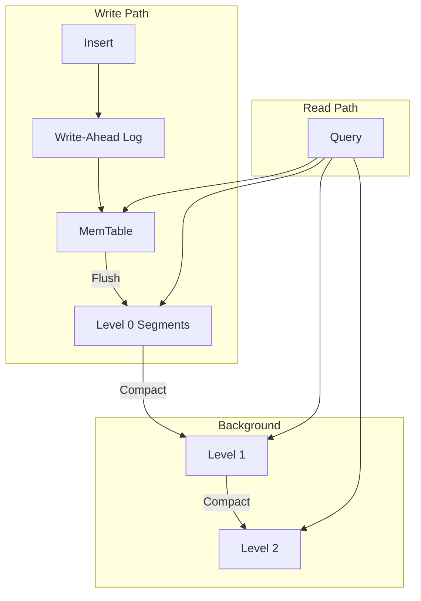

# Core Concepts

Understanding Vecgo's architecture and design decisions.
{: .fs-6 .fw-300 }

---

## Vector Embeddings

Vecgo stores and searches **vector embeddings**—numerical representations of data in high-dimensional space.

```
"The quick brown fox" → [0.12, -0.34, 0.56, ..., 0.78]  (384 dimensions)
```

These embeddings capture semantic meaning, enabling similarity search based on content rather than keywords.

### Common Embedding Sources

| Source | Typical Dimensions | Use Case |
|:-------|:-------------------|:---------|
| OpenAI `text-embedding-3-small` | 1536 | General text |
| Cohere `embed-english-v3` | 1024 | Multilingual text |
| Sentence Transformers | 384-768 | Open source text |
| CLIP | 512-768 | Images + text |

---

## Distance Metrics

Vecgo supports multiple distance functions for measuring vector similarity:

### Cosine Similarity

```go
vecgo.WithDistance(vecgo.DistanceCosine)
```

Best for: **Normalized embeddings** (most common)

Measures the angle between vectors, ignoring magnitude. Returns values from -1 (opposite) to 1 (identical).

### Euclidean (L2) Distance

```go
vecgo.WithDistance(vecgo.DistanceL2)
```

Best for: **Spatial data, clustering**

Measures straight-line distance in vector space. Lower values = more similar.

### Dot Product

```go
vecgo.WithDistance(vecgo.DistanceDot)
```

Best for: **Maximum inner product search (MIPS)**

Measures alignment including magnitude. Higher values = more similar.

{: .tip }
When in doubt, use **Cosine**. Most embedding models are optimized for it.

---

## Storage Architecture

Vecgo uses an **LSM-tree** (Log-Structured Merge-tree) architecture:



### Write Path

1. **WAL** - Writes logged for durability
2. **MemTable** - In-memory buffer for fast inserts
3. **Flush** - MemTable → immutable segment on disk

### Read Path

1. Check MemTable (newest data)
2. Check segments from newest to oldest
3. Merge results

### Compaction

Background process merges segments to:
- Reduce read amplification
- Reclaim space from deleted vectors
- Optimize index structures

---

## Index Types

Vecgo supports multiple index types for different performance tradeoffs:

### HNSW (Default)

Hierarchical Navigable Small World graph.

```go
vecgo.WithIndexType(vecgo.IndexHNSW)
vecgo.WithHNSWConfig(vecgo.HNSWConfig{
    M:              16,  // Connections per node
    EfConstruction: 200, // Build quality
})
```

| Pros | Cons |
|:-----|:-----|
| Very fast search | Higher memory usage |
| Good recall | Slower inserts |
| No training needed | |

Best for: **Most use cases**, especially < 10M vectors.

### IVF-Flat

Inverted file index with flat search within clusters.

```go
vecgo.WithIndexType(vecgo.IndexIVFFlat)
vecgo.WithIVFConfig(vecgo.IVFConfig{
    NClusters: 1024,
    NProbe:    32,
})
```

| Pros | Cons |
|:-----|:-----|
| Lower memory | Requires training |
| Faster builds | Slightly lower recall |
| Tunable accuracy/speed | |

Best for: **Large datasets** (10M+ vectors) where memory is constrained.

### Flat (Brute Force)

Exact nearest neighbor search.

```go
vecgo.WithIndexType(vecgo.IndexFlat)
```

| Pros | Cons |
|:-----|:-----|
| Perfect recall | O(n) search time |
| No tuning needed | Slow for large datasets |

Best for: **Small datasets** (< 10K vectors) or when 100% recall is required.

---

## Quantization

Reduce memory usage by compressing vectors:

### Product Quantization (PQ)

```go
vecgo.WithQuantization(vecgo.QuantizationPQ)
vecgo.WithPQConfig(vecgo.PQConfig{
    M:    8,   // Subvectors
    Bits: 8,   // Bits per subvector
})
```

Compresses 384-dim float32 (1536 bytes) to ~32 bytes (20x reduction).

### Scalar Quantization (SQ8)

```go
vecgo.WithQuantization(vecgo.QuantizationSQ8)
```

Compresses float32 to uint8 (4x reduction) with minimal recall loss.

{: .warning }
Quantization requires training data. Insert vectors before enabling.

---

## Metadata & Filtering

Attach structured metadata to vectors:

```go
db.Insert(ctx, "doc-1", embedding, map[string]any{
    "title":    "Vector Databases 101",
    "category": "tutorial",
    "year":     2024,
    "tags":     []string{"database", "ml"},
})
```

### Filter Operators

```go
import "github.com/hupe1980/vecgo/metadata"

// Equality
metadata.Eq("category", "tutorial")

// Comparison
metadata.Gt("year", 2023)
metadata.Lte("price", 100.0)

// String matching
metadata.Contains("title", "Vector")

// Array contains
metadata.In("tags", "database")

// Logical operators
metadata.And(filter1, filter2)
metadata.Or(filter1, filter2)
metadata.Not(filter)
```

### Pre-filtering vs Post-filtering

Vecgo uses **pre-filtering** when possible—filtering candidates before distance calculation for better performance.

---

## Durability

### Commit Modes

```go
// Explicit commit (default)
db.Insert(ctx, id, vec, meta)
db.Commit(ctx)  // Persists to disk

// Auto-commit
db, _ := vecgo.Open(ctx, backend,
    vecgo.WithAutoCommit(true),
    vecgo.WithAutoCommitInterval(time.Second),
)
```

### Crash Recovery

On restart, Vecgo:
1. Replays WAL to recover uncommitted writes
2. Rebuilds MemTable state
3. Resumes normal operation

{: .note }
Committed data is never lost. Uncommitted data may be recovered from WAL.

---

## Next Steps

- [Configuration Guide](../../guides/configuration/) - All options explained
- [Tuning Guide](../../guides/tuning/) - Optimize for your workload
- [API Reference](../../reference/) - Complete API documentation
