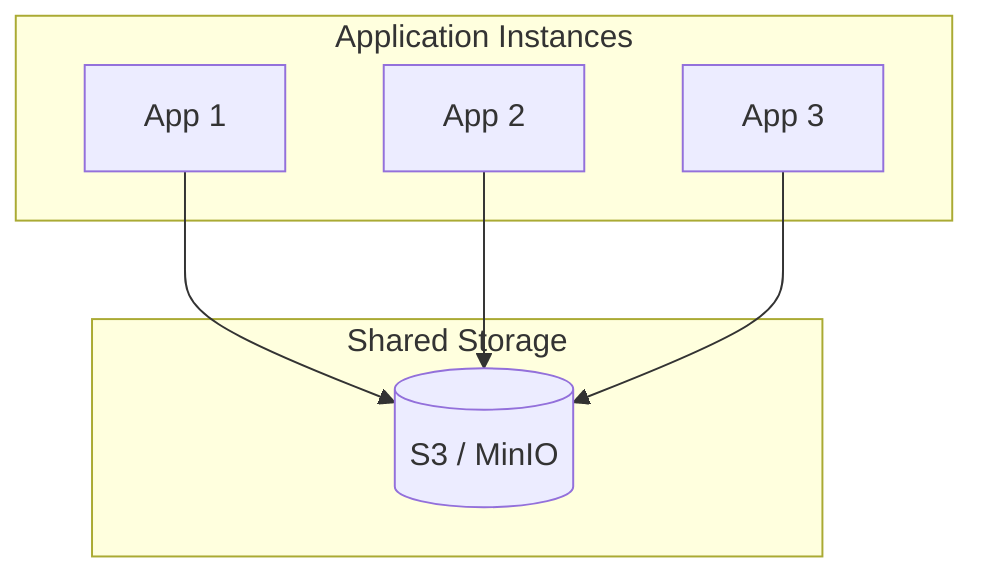

# Deployment

Production deployment patterns and best practices.
{: .fs-6 .fw-300 }

---

## Deployment Models

### Embedded (Recommended)

Vecgo runs in your application process—no separate service to manage.

```go
// In your application
db, _ := vecgo.Open(ctx, vecgo.NewLocalBackend("/data/vectors"),
    vecgo.WithDimension(1536),
)
defer db.Close(ctx)

// Use db directly
http.HandleFunc("/search", func(w http.ResponseWriter, r *http.Request) {
    results, _ := db.Search(ctx, query, 10)
    json.NewEncoder(w).Encode(results)
})
```

**Pros:** Simple, low latency, no network overhead  
**Cons:** Single node, data local to instance

### Shared Storage

Multiple instances share cloud storage (S3/MinIO).



```go
// Each instance connects to shared storage
db, _ := vecgo.Open(ctx, vecgo.NewS3Backend(s3Client, "my-bucket", "vectors/"),
    vecgo.WithDimension(1536),
    vecgo.WithBlockCacheSize(1 << 30),  // 1 GB local cache
)
```

**Pros:** Shared data, cloud-native  
**Cons:** Higher latency, requires cache tuning

---

## Container Deployment

### Dockerfile

```dockerfile
FROM golang:1.22-alpine AS builder

WORKDIR /app
COPY go.mod go.sum ./
RUN go mod download

COPY . .
RUN CGO_ENABLED=0 GOOS=linux go build -o server ./cmd/server

FROM alpine:3.19
RUN apk add --no-cache ca-certificates

COPY --from=builder /app/server /server

# Data volume
VOLUME /data

EXPOSE 8080
CMD ["/server"]
```

### Docker Compose

```yaml
version: '3.8'

services:
  vecgo-app:
    build: .
    ports:
      - "8080:8080"
    volumes:
      - vecgo-data:/data
    environment:
      - VECGO_DATA_DIR=/data
    deploy:
      resources:
        limits:
          memory: 4G
        reservations:
          memory: 2G

volumes:
  vecgo-data:
```

### Kubernetes

```yaml
apiVersion: apps/v1
kind: StatefulSet
metadata:
  name: vecgo-app
spec:
  serviceName: vecgo
  replicas: 1
  selector:
    matchLabels:
      app: vecgo
  template:
    metadata:
      labels:
        app: vecgo
    spec:
      containers:
      - name: vecgo
        image: myregistry/vecgo-app:latest
        ports:
        - containerPort: 8080
        resources:
          requests:
            memory: "2Gi"
            cpu: "1000m"
          limits:
            memory: "4Gi"
            cpu: "2000m"
        volumeMounts:
        - name: data
          mountPath: /data
  volumeClaimTemplates:
  - metadata:
      name: data
    spec:
      accessModes: ["ReadWriteOnce"]
      storageClassName: fast-ssd
      resources:
        requests:
          storage: 100Gi
```

---

## Resource Sizing

### Memory

```
Base memory = 500 MB
Per-vector memory = dimension × 4 bytes (float32)
                  = dimension × 1 byte  (SQ8)
Index overhead = 20-50% of vector storage
Block cache = configurable (recommend 10-20% of total)
```

**Example:** 1M vectors × 768 dimensions with SQ8

```
Vectors: 1M × 768 × 1 byte = 730 MB
Index: 730 MB × 0.3 = 220 MB
Cache: 200 MB
Base: 500 MB
────────────────────────────
Total: ~1.7 GB (recommend 4 GB limit)
```

### CPU

| Workload | Cores |
|:---------|:------|
| Light (< 100 QPS) | 1-2 |
| Medium (100-1000 QPS) | 2-4 |
| Heavy (> 1000 QPS) | 4-8 |

### Storage

```
Data size = vectors × (dimension × bytes_per_element + metadata_size)
WAL size = 2 × memtable_size
Compaction headroom = 2 × data_size (temporary)
────────────────────────────
Total = 3-4 × expected_data_size
```

---

## High Availability

### Read Replicas

For read-heavy workloads, deploy multiple instances with shared storage:

```go
// Primary (writes)
primary, _ := vecgo.Open(ctx, backend,
    vecgo.WithDimension(1536),
)

// Replicas (reads) - same backend, read-only
replica, _ := vecgo.Open(ctx, backend,
    vecgo.WithDimension(1536),
    vecgo.WithReadOnly(true),
)
```

### Graceful Shutdown

```go
func main() {
    db, _ := vecgo.Open(ctx, backend, opts...)
    
    // Handle shutdown
    sigCh := make(chan os.Signal, 1)
    signal.Notify(sigCh, syscall.SIGINT, syscall.SIGTERM)
    
    go func() {
        <-sigCh
        log.Println("Shutting down...")
        
        // Commit pending writes
        ctx, cancel := context.WithTimeout(context.Background(), 30*time.Second)
        defer cancel()
        
        if err := db.Commit(ctx); err != nil {
            log.Printf("Commit error: %v", err)
        }
        if err := db.Close(ctx); err != nil {
            log.Printf("Close error: %v", err)
        }
        
        os.Exit(0)
    }()
    
    // Run server...
}
```

---

## Monitoring

### Health Check

```go
http.HandleFunc("/health", func(w http.ResponseWriter, r *http.Request) {
    stats := db.Stats()
    
    health := map[string]any{
        "status":       "healthy",
        "vectors":      stats.VectorCount,
        "segments":     stats.SegmentCount,
        "memtable_pct": stats.MemTableUsage,
    }
    
    json.NewEncoder(w).Encode(health)
})
```

### Prometheus Metrics

```go
import "github.com/prometheus/client_golang/prometheus"

var (
    searchLatency = prometheus.NewHistogramVec(
        prometheus.HistogramOpts{
            Name:    "vecgo_search_duration_seconds",
            Help:    "Search latency distribution",
            Buckets: []float64{.001, .005, .01, .025, .05, .1, .25, .5, 1},
        },
        []string{"status"},
    )
    
    vectorCount = prometheus.NewGauge(prometheus.GaugeOpts{
        Name: "vecgo_vectors_total",
        Help: "Total number of vectors",
    })
)

func init() {
    prometheus.MustRegister(searchLatency, vectorCount)
}
```

---

## Security

### File Permissions

```bash
# Data directory
chmod 700 /data/vectors
chown app:app /data/vectors
```

### Network Isolation

- Run Vecgo in private subnet
- No direct external access
- Access through application API only

### Encryption at Rest

Use encrypted volumes:

```yaml
# Kubernetes encrypted storage
apiVersion: storage.k8s.io/v1
kind: StorageClass
metadata:
  name: encrypted-ssd
provisioner: kubernetes.io/aws-ebs
parameters:
  type: gp3
  encrypted: "true"
```

---

## Backup Strategy

### Snapshot Backup

```go
func backup(db *vecgo.DB, destPath string) error {
    // Ensure consistent state
    if err := db.Commit(ctx); err != nil {
        return err
    }
    
    // Create snapshot
    return db.Snapshot(ctx, destPath)
}
```

### Continuous Backup to S3

```go
// Configure with backup location
db, _ := vecgo.Open(ctx, backend,
    vecgo.WithBackupBackend(s3Backend),
    vecgo.WithBackupInterval(time.Hour),
)
```

See [Backup & Recovery](backup/) for detailed strategies.
