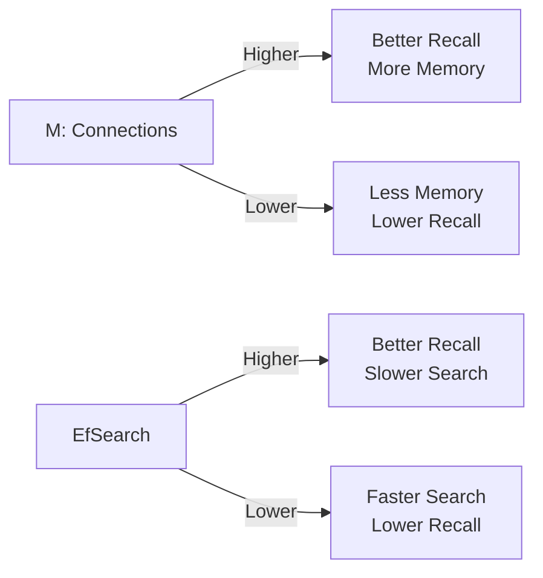

# Performance Tuning

Optimize Vecgo for your specific workload.
{: .fs-6 .fw-300 }

---

## Quick Wins

Before diving deep, try these high-impact optimizations:

| Optimization | Impact | Effort |
|:-------------|:-------|:-------|
| Enable SIMD | 3-10x faster search | None (auto-detected) |
| Batch inserts | 5-20x faster writes | Low |
| Tune `EfSearch` | Latency ↔ Recall | Low |
| Add block cache | 2-5x faster reads | Low |
| Use SQ8 quantization | 4x less memory | Medium |

---

## SIMD Acceleration

Vecgo automatically detects and uses the best SIMD instructions:

| Platform | Instruction Set | Speedup |
|:---------|:----------------|:--------|
| x86-64 | AVX-512 | 8-16x |
| x86-64 | AVX2 | 4-8x |
| ARM64 | NEON | 4-8x |

### Verify SIMD is Active

```go
import "github.com/hupe1980/vecgo/internal/simd"

fmt.Println("Active ISA:", simd.ActiveISA())
// Output: Active ISA: avx2
```

### Force Specific ISA

```bash
VECGO_SIMD=avx512 ./myapp   # Force AVX-512
VECGO_SIMD=avx2 ./myapp     # Force AVX2
VECGO_SIMD=none ./myapp     # Disable (for debugging)
```

{: .warning }
SIMD is disabled if your CPU doesn't support the requested instruction set.

---

## Index Tuning

### HNSW Parameters



#### Recommended Settings by Dataset Size

| Vectors | M | EfConstruction | EfSearch |
|:--------|:--|:---------------|:---------|
| < 10K | 16 | 100 | 50 |
| 10K-100K | 16 | 200 | 100 |
| 100K-1M | 24 | 200 | 150 |
| 1M-10M | 32 | 400 | 200 |
| > 10M | 48 | 400 | 300 |

#### Tuning for Recall

```go
// Start with defaults
config := vecgo.HNSWConfig{M: 16, EfConstruction: 200, EfSearch: 100}

// If recall < 95%, increase EfSearch first
config.EfSearch = 200

// Still low? Increase M (requires reindex)
config.M = 32
config.EfConstruction = 400
```

### IVF Parameters

```go
// Rule of thumb: NClusters = sqrt(n) to 4*sqrt(n)
n := 1_000_000
nClusters := int(math.Sqrt(float64(n)) * 2)  // ~2000

config := vecgo.IVFConfig{
    NClusters: nClusters,
    NProbe:    nClusters / 20,  // 5% of clusters
}
```

---

## Memory Optimization

### Quantization Comparison

| Method | Memory/Vector | Recall Impact | Best For |
|:-------|:--------------|:--------------|:---------|
| None | 4 × dim bytes | Baseline | Small datasets |
| SQ8 | 1 × dim bytes | < 1% loss | Most cases |
| PQ | M bytes | 2-5% loss | Large datasets |
| INT4 | 0.5 × dim bytes | 3-8% loss | Extreme scale |

**Example:** 1M vectors × 768 dimensions

| Method | Memory |
|:-------|:-------|
| float32 | 2.9 GB |
| SQ8 | 730 MB |
| PQ (M=32) | 32 MB |

### Enable SQ8 (Recommended)

```go
db, _ := vecgo.Open(ctx, backend,
    vecgo.WithDimension(768),
    vecgo.WithQuantization(vecgo.QuantizationSQ8),
)
```

### Block Cache Sizing

```go
// Target: fit hot data in cache
// Rule: 10-20% of total index size
vecgo.WithBlockCacheSize(512 * 1024 * 1024)  // 512 MB
```

---

## Write Optimization

### Batch Inserts

```go
// ❌ Slow: Individual inserts
for _, vec := range vectors {
    db.Insert(ctx, vec.ID, vec.Values, vec.Metadata)
}

// ✅ Fast: Batch insert
db.BatchInsert(ctx, vectors)
```

| Batch Size | Throughput |
|:-----------|:-----------|
| 1 | ~5K/sec |
| 100 | ~30K/sec |
| 1000 | ~50K/sec |
| 10000 | ~60K/sec |

### Commit Strategy

```go
// Option 1: Explicit commits after batches
for batch := range batches {
    db.BatchInsert(ctx, batch)
}
db.Commit(ctx)

// Option 2: Auto-commit for streaming
db, _ := vecgo.Open(ctx, backend,
    vecgo.WithAutoCommit(true),
    vecgo.WithAutoCommitInterval(5 * time.Second),
)
```

### MemTable Size

```go
// Larger MemTable = fewer flushes = faster bulk loads
vecgo.WithMemTableSize(256 * 1024 * 1024)  // 256 MB for bulk loads
vecgo.WithMemTableSize(32 * 1024 * 1024)   // 32 MB for streaming
```

---

## Search Optimization

### Parallel Search

```go
// Search is thread-safe - parallelize freely
var wg sync.WaitGroup
for _, query := range queries {
    wg.Add(1)
    go func(q []float32) {
        defer wg.Done()
        results, _ := db.Search(ctx, q, 10)
        process(results)
    }(query)
}
wg.Wait()
```

### Pre-filtering vs Post-filtering

```go
// ✅ Efficient: Filter during search (pre-filtering)
db.Search(ctx, query, 10,
    vecgo.WithFilter(metadata.Eq("category", "tech")),
)

// ❌ Inefficient: Filter after search (post-filtering)
results, _ := db.Search(ctx, query, 1000)
filtered := filterByCategory(results, "tech")[:10]
```

### Reduce Result Size

```go
// Only fetch what you need
db.Search(ctx, query, 10,
    vecgo.WithIncludeVectors(false),   // Don't return vectors
    vecgo.WithIncludeMetadata(false),  // Don't return metadata
)
```

---

## Benchmarking

### Measure Your Workload

```go
func benchmarkSearch(db *vecgo.DB, queries [][]float32) {
    start := time.Now()
    for _, q := range queries {
        db.Search(ctx, q, 10)
    }
    elapsed := time.Since(start)
    qps := float64(len(queries)) / elapsed.Seconds()
    avgLatency := elapsed / time.Duration(len(queries))
    
    fmt.Printf("QPS: %.0f, Avg Latency: %v\n", qps, avgLatency)
}
```

### Measure Recall

```go
func measureRecall(db *vecgo.DB, queries [][]float32, groundTruth [][]string) float64 {
    var totalRecall float64
    for i, q := range queries {
        results, _ := db.Search(ctx, q, 10)
        hits := countMatches(results, groundTruth[i])
        totalRecall += float64(hits) / float64(len(groundTruth[i]))
    }
    return totalRecall / float64(len(queries))
}
```

---

## Production Checklist

- [ ] SIMD enabled and verified
- [ ] Appropriate index type for dataset size
- [ ] Quantization enabled if memory-constrained
- [ ] Block cache sized for working set
- [ ] Batch inserts for bulk loads
- [ ] Commit strategy matches durability needs
- [ ] Filters use efficient pre-filtering
- [ ] Monitoring for QPS, latency, recall
