# Vecgo Operations Runbook

This guide covers operational procedures for managing Vecgo in production.

## Quick Health Check

```mermaid
flowchart TD
    Start[Health Check] --> Mem{MemTable<br/>< 90%?}
    Mem -->|Yes| Disk{Disk<br/>< 80%?}
    Mem -->|No| Alert1[⚠️ High write pressure<br/>Consider Commit]
    
    Disk -->|Yes| Latency{p99 Search<br/>< 100ms?}
    Disk -->|No| Alert2[⚠️ Low disk space<br/>Add storage]
    
    Latency -->|Yes| OK[✅ Healthy]
    Latency -->|No| Alert3[⚠️ High latency<br/>Check CPU/Cache]
    
    style OK fill:#e8f5e9
    style Alert1 fill:#fff3e0
    style Alert2 fill:#ffebee
    style Alert3 fill:#fff3e0
```



## Monitoring

Key metrics to alert on (via a Prometheus `engine.MetricsObserver` implementation; see `examples/observability`):

| Metric | Threshold | Severity | Investigation |
|--------|-----------|----------|---------------|
| `vecgo_backpressure_events_total` | > 10 / min | 🔴 Critical | System overloaded. Increase memory limits or shard writes. |
| `vecgo_queue_depth{queue="compaction_queue"}` | > 0 (sustained) | 🟡 Warning | Compaction falling behind. Check disk IOPS. |
| `vecgo_operation_latency_seconds{op="search"}` | p99 > 100ms | 🟡 Warning | CPU contention or slow filtered search. |
| `vecgo_memtable_size_bytes` | > 90% of Limit | 🟡 Warning | High write pressure. Trigger `Commit()`. |
| `vecgo_segments_pruned_ratio` | < 20% | 🟡 Warning | Poor filter selectivity. Review query patterns. |

### Query Statistics Monitoring

Use `WithStats()` to collect per-query metrics for debugging slow queries:

```go
var stats vecgo.QueryStats
results, err := db.Search(ctx, query, 10, vecgo.WithStats(&stats))

// Log for analysis
log.Info("search completed",
    "segments_searched", stats.SegmentsSearched,
    "segments_pruned_stats", stats.SegmentsPrunedByStats,
    "segments_pruned_bloom", stats.SegmentsPrunedByBloom,
    "vectors_scanned", stats.VectorsScanned,
    "latency", stats.Latency,
    "cost", stats.CostEstimate(),
)

// Human-readable explanation for debugging
if stats.Latency > 100*time.Millisecond {
    log.Warn("slow query detected", "explain", stats.Explain())
}
```

### Prometheus Example

```yaml
groups:
  - name: vecgo
    rules:
      - alert: VecgoBackpressure
        expr: rate(vecgo_backpressure_events_total[5m]) > 0.1
        for: 2m
        labels:
          severity: critical
        annotations:
          summary: "Vecgo experiencing backpressure"
          
      - alert: VecgoHighLatency
        expr: histogram_quantile(0.99, vecgo_operation_latency_seconds{op="search"}) > 0.1
        for: 5m
        labels:
          severity: warning
```

## Failure Scenarios

```mermaid
flowchart LR
    subgraph Failures["⚠️ Common Failures"]
        DiskFull[Disk Full]
        OOM[Out of Memory]
        Corrupt[Corruption]
    end
    
    subgraph Recovery["✅ Recovery Actions"]
        AddDisk[Add Storage]
        TuneMem[Tune Limits]
        Restore[Restore Backup]
    end
    
    DiskFull --> AddDisk
    OOM --> TuneMem
    Corrupt --> Restore
    
    style Failures fill:#ffebee
    style Recovery fill:#e8f5e9
```



### Disk Full

**Symptoms**:
- `Insert` returns `ErrBackpressure` or IO errors.
- Logs show "write: no space left on device".

**Resolution**:
1. **Immediate**: Add disk space or delete old files.
2. **Recovery**: Vecgo handles disk-full gracefully. Once space is available, writes will succeed.
   - If commit failed, uncommitted data remains in MemTable.

**Prevention**:
- Call `Commit()` regularly to bound MemTable size.
- Monitor disk usage alerts at 80%.

### Out of Memory (OOM)

**Symptoms**:
- Process crash (kernel OOM killer).
- `ErrBackpressure` returned if `ResourceController` is effective.

**Resolution**:
1. Check `vecgo_memtable_size_bytes`.
2. Tune `WithResourceController` limits to be lower than container limit.
3. Reduce `WithBlockCacheSize` (default 256MB).

### Corruption Detected

**Symptoms**:
- `ErrCorrupt` returned on Open.
- Logs indicate "checksum mismatch" or "invalid magic".

**Resolution**:
1. **Segment Corruption**: Delete the corrupted `.bin` file. Vecgo will load remaining segments (might lose data in that segment).
2. **Manifest Corruption**: If manifest is corrupt, wipe directory and restore from backup.
3. **Restore**: Restore from backup or rebuild from source data.
4. **Time-Travel**: Use `WithVersion(n-1)` to open a previous known-good version.

## Time-Travel for Operations

Vecgo preserves historical manifest versions, enabling operational recovery scenarios:

### Rolling Back a Bad Deployment

```go
// Find the last known-good version (before deployment)
goodVersion := uint64(42)  // From deployment logs or monitoring

// Open at that version
db, err := vecgo.Open(ctx, vecgo.Local("./data"), vecgo.WithVersion(goodVersion))
if err != nil {
    log.Fatal("rollback failed", err)
}

// Verify data integrity
stats := db.Stats()
log.Info("rolled back", "version", stats.ManifestID, "vectors", stats.TotalVectors)
```

### Debugging Recall Regressions

```go
// Compare recall between versions
oldDB, _ := vecgo.Open(ctx, vecgo.Local("./data"), vecgo.WithVersion(oldVersion))
newDB, _ := vecgo.Open(ctx, vecgo.Local("./data"))  // Current version

oldResults, _ := oldDB.Search(ctx, query, 100)
newResults, _ := newDB.Search(ctx, query, 100)

// Compute recall difference
oldIDs := extractIDs(oldResults)
newIDs := extractIDs(newResults)
recall := computeOverlap(oldIDs, newIDs)
log.Info("recall comparison", "old_count", len(oldIDs), "new_count", len(newIDs), "overlap", recall)
```

### Retention Policy

Configure how many historical versions to keep:

```go
policy := vecgo.RetentionPolicy{
    KeepVersions: 10,                    // Keep last 10 versions
    KeepDuration: 7 * 24 * time.Hour,    // Or keep 7 days of history
}
db, _ := vecgo.Open(ctx, vecgo.Local("./data"), vecgo.WithRetentionPolicy(policy))

// Periodically clean up old versions
db.Vacuum(ctx)  // Safe to call from cron job
```

**Storage Impact**: Each version adds ~10KB manifest overhead. Segments are shared across versions (copy-on-write). Vacuum reclaims segments no longer referenced by any retained version.

## Capacity Planning


**Formula**:
```
RAM = (MemTableSize) + (BlockCacheSize) + (IndexOverhead)
Disk = (RawVectorSize * 1.5) // compaction headroom
```

**Example (10M vectors, 1536 dim, float32)**:

| Component | Calculation | Size |
|-----------|-------------|------|
| Raw Data | 10M × 1536 × 4B | ~60GB |
| Disk (with compaction) | 60GB × 1.5 | ~90GB |
| BlockCache | Recommended | 4GB |
| MemTable | Configured | 1GB |
| HNSW Overhead | ~5% of L0 | ~500MB |
| **Total RAM** | | **~8GB**
