# Vecgo Operations Runbook

This guide covers operational procedures for managing Vecgo in production.

## Quick Health Check

```mermaid
flowchart TD
    Start[Health Check] --> Mem{MemTable<br/>< 90%?}
    Mem -->|Yes| Disk{Disk<br/>< 80%?}
    Mem -->|No| Alert1[⚠️ High write pressure<br/>Consider Commit]
    
    Disk -->|Yes| Latency{p99 Search<br/>< 100ms?}
    Disk -->|No| Alert2[⚠️ Low disk space<br/>Add storage]
    
    Latency -->|Yes| OK[✅ Healthy]
    Latency -->|No| Alert3[⚠️ High latency<br/>Check CPU/Cache]
    
    style OK fill:#e8f5e9
    style Alert1 fill:#fff3e0
    style Alert2 fill:#ffebee
    style Alert3 fill:#fff3e0
```



## Monitoring

Key metrics to alert on (via a Prometheus `engine.MetricsObserver` implementation; see `examples/observability`):

| Metric | Threshold | Severity | Investigation |
|--------|-----------|----------|---------------|
| `vecgo_backpressure_events_total` | > 10 / min | 🔴 Critical | System overloaded. Increase memory limits or shard writes. |
| `vecgo_queue_depth{queue="compaction_queue"}` | > 0 (sustained) | 🟡 Warning | Compaction falling behind. Check disk IOPS. |
| `vecgo_operation_latency_seconds{op="search"}` | p99 > 100ms | 🟡 Warning | CPU contention or slow filtered search. |
| `vecgo_memtable_size_bytes` | > 90% of Limit | 🟡 Warning | High write pressure. Trigger `Commit()`. |

### Prometheus Example

```yaml
groups:
  - name: vecgo
    rules:
      - alert: VecgoBackpressure
        expr: rate(vecgo_backpressure_events_total[5m]) > 0.1
        for: 2m
        labels:
          severity: critical
        annotations:
          summary: "Vecgo experiencing backpressure"
          
      - alert: VecgoHighLatency
        expr: histogram_quantile(0.99, vecgo_operation_latency_seconds{op="search"}) > 0.1
        for: 5m
        labels:
          severity: warning
```

## Failure Scenarios

```mermaid
flowchart LR
    subgraph Failures["⚠️ Common Failures"]
        DiskFull[Disk Full]
        OOM[Out of Memory]
        Corrupt[Corruption]
    end
    
    subgraph Recovery["✅ Recovery Actions"]
        AddDisk[Add Storage]
        TuneMem[Tune Limits]
        Restore[Restore Backup]
    end
    
    DiskFull --> AddDisk
    OOM --> TuneMem
    Corrupt --> Restore
    
    style Failures fill:#ffebee
    style Recovery fill:#e8f5e9
```



### Disk Full

**Symptoms**:
- `Insert` returns `ErrBackpressure` or IO errors.
- Logs show "write: no space left on device".

**Resolution**:
1. **Immediate**: Add disk space or delete old files.
2. **Recovery**: Vecgo handles disk-full gracefully. Once space is available, writes will succeed.
   - If commit failed, uncommitted data remains in MemTable.

**Prevention**:
- Call `Commit()` regularly to bound MemTable size.
- Monitor disk usage alerts at 80%.

### Out of Memory (OOM)

**Symptoms**:
- Process crash (kernel OOM killer).
- `ErrBackpressure` returned if `ResourceController` is effective.

**Resolution**:
1. Check `vecgo_memtable_size_bytes`.
2. Tune `WithResourceController` limits to be lower than container limit.
3. Reduce `WithBlockCacheSize` (default 256MB).

### Corruption Detected

**Symptoms**:
- `ErrCorrupt` returned on Open.
- Logs indicate "checksum mismatch" or "invalid magic".

**Resolution**:
1. **Segment Corruption**: Delete the corrupted `.bin` file. Vecgo will load remaining segments (might lose data in that segment).
2. **Manifest Corruption**: If manifest is corrupt, wipe directory and restore from backup.
3. **Restore**: Restore from backup or rebuild from source data.

## Capacity Planning


**Formula**:
```
RAM = (MemTableSize) + (BlockCacheSize) + (IndexOverhead)
Disk = (RawVectorSize * 1.5) // compaction headroom
```

**Example (10M vectors, 1536 dim, float32)**:

| Component | Calculation | Size |
|-----------|-------------|------|
| Raw Data | 10M × 1536 × 4B | ~60GB |
| Disk (with compaction) | 60GB × 1.5 | ~90GB |
| BlockCache | Recommended | 4GB |
| MemTable | Configured | 1GB |
| HNSW Overhead | ~5% of L0 | ~500MB |
| **Total RAM** | | **~8GB**
