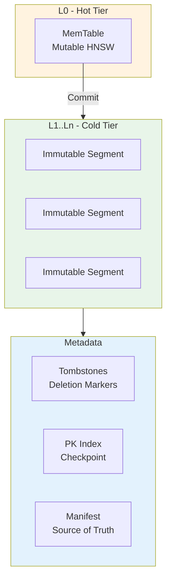
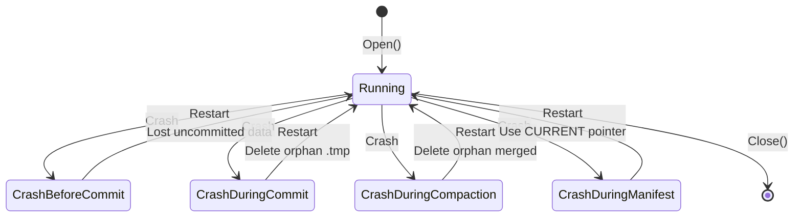

# Vecgo Durability Architecture

## Overview

Vecgo uses a **Commit-Oriented** architecture with **Immutable Segments** to ensure durability.
This pattern uses append-only versioned commits with atomic manifest updates. Unlike WAL-based databases (PostgreSQL, DuckDB), no write-ahead log is required.

```mermaid
flowchart LR
    subgraph Memory["🧠 Memory (Volatile)"]
        MT[MemTable<br/>HNSW Index]
    end
    
    subgraph Disk["💾 Disk (Durable)"]
        Seg1[Segment 1]
        Seg2[Segment 2]
        SegN[Segment N]
        Man[MANIFEST]
        Cur[CURRENT]
    end
    
    MT -->|Commit()| Seg1
    Seg1 & Seg2 & SegN --> Man
    Man --> Cur
    
    style Memory fill:#fff3e0
    style Disk fill:#e8f5e9
```

## Durability Model

**Key Principle:** Data is durable only after an explicit `Commit(ctx)` call.

| State | Survives Crash? | Description |
|-------|-----------------|-------------|
| Before `Insert()` | N/A | - |
| After `Insert()`, before `Commit()` | ❌ No | Data is buffered in MemTable (memory only) |
| After `Commit()` | ✅ Yes | Data is written to immutable segment |
| After `Close()` | ✅ Yes | `Close()` auto-commits pending data |

This is the same contract as SQLite's explicit transaction mode or Git commits.

## Storage Hierarchy



1.  **MemTable**: In-memory mutable structure (HNSW index). **Not durable until committed.**
2.  **Immutable Segments**: On-disk segments created by `Commit()`. Source of truth.
3.  **Tombstones**: Per-segment deletion markers (persisted on close).
4.  **PK Index Checkpoint**: Snapshot of the Primary Key Index (speeds up restart).
5.  **Manifest**: Atomic pointer to current database state (segments, PK index path).

## Crash Scenarios & Recovery



### 1. Crash Before Commit
*   **State**: Data exists only in MemTable (memory).
*   **Recovery**: On restart, only committed segments are visible. Uncommitted data is lost (by design).
*   **User Expectation**: Users know uncommitted data is at-risk, same as any database transaction.

### 2. Crash During Commit (Segment Write)
*   **State**: Temporary segment file `segment_123.bin.tmp` exists. Manifest points to previous generation.
*   **Recovery**:
    1.  `Open` loads Manifest (Source of Truth).
    2.  Scans directory for `segment_*` files.
    3.  Identifies files NOT in Manifest (orphans).
    4.  Deletes orphan files to reclaim space.
    5.  System starts with consistent state from last successful commit.

### 3. Crash During Compaction
*   **State**: `segment_merged.bin` might exist. Inputs `segment_A.bin` and `segment_B.bin` still exist. Manifest points to A and B.
*   **Recovery**: 
    1.  Loads Manifest (points to A, B).
    2.  Detects `segment_merged.bin` as orphan (ID not in manifest).
    3.  Deletes orphan.
    4.  System starts with A and B intact. Compaction will be re-scheduled.

### 4. Crash During Manifest Update
*   **State**: `MANIFEST-NNNNNN.bin` fully written. `CURRENT` file update failed.
*   **Recovery**:
    1.  `CURRENT` file points to the last successfully committed manifest.
    2.  Orphan manifest files are safe to ignore (or clean up).
    3.  System starts from last known good state.

## Invariants

*   **Atomicity**: Segment visibility toggles instantly via Manifest update.
*   **Consistency**: Only committed data is visible after restart.
*   **Durability**: Committed data survives any crash.
*   **Simplicity**: No WAL replay, no recovery logs, instant startup.

## Why No WAL?

Traditional databases use Write-Ahead Logging (WAL) for single-row transaction durability.
Vector databases have different workload characteristics:

| Workload | Pattern | Needs WAL? |
|----------|---------|------------|
| **RAG pipelines** | Batch embed → batch insert → commit | ❌ No |
| **Semantic search** | Build index offline → deploy → query | ❌ No |
| **Recommendations** | Periodic batch updates → serve queries | ❌ No |
| **ML embeddings** | Checkpoint after training epoch | ❌ No |

The commit-oriented model eliminates:
- WAL rotation complexity
- Crash recovery replay time
- Checkpointing overhead
- ~500+ lines of recovery code

This is the same approach used by Git — append-only versioned commits without WAL.
