# Vecgo Performance Tuning Guide

This guide covers performance tuning for Vecgo's tiered engine architecture.

## Quick Reference

```mermaid
flowchart LR
    subgraph Writes["✍️ Write Path"]
        Insert[Insert] --> MT[MemTable<br/>HNSW M=32]
        MT -->|Commit| Seg[Segment]
    end
    
    subgraph Reads["🔍 Read Path"]
        Query[Query] --> L0[L0 Search<br/>EF=200+]
        L0 --> Merge[Merge Results]
        SegSearch[Segment Search] --> Merge
    end
    
    subgraph Tuning["⚙️ Key Parameters"]
        M["M: Graph connectivity"]
        EF["EF: Search quality"]
        Cache["Cache: Memory budget"]
    end
    
    style Writes fill:#e8f5e9
    style Reads fill:#e3f2fd
    style Tuning fill:#fff3e0
```



## API Overview

```go
import (
    "context"
    "github.com/hupe1980/vecgo"
)

ctx := context.Background()

// Create a new index
db, err := vecgo.Open(ctx, vecgo.Local("./data"), vecgo.Create(128, vecgo.MetricL2))
if err != nil {
    panic(err)
}
defer db.Close()

// Insert vectors
_, _ = db.Insert(ctx, make([]float32, 128), nil, nil)

// Commit to disk (durability point)
if err := db.Commit(ctx); err != nil {
    panic(err)
}

// Search
results, _ := db.Search(ctx, make([]float32, 128), 10)
```

The engine supports **automatic flush triggers** based on MemTable size. However, call `Commit(ctx)` explicitly at batch boundaries for deterministic persistence.

---

## SIMD and CPU Features

Distance computation is SIMD-optimized with runtime CPU feature detection:


| Platform | Features | Speedup |
|----------|----------|---------|
| amd64 | AVX-512, AVX2 | 4-8× |
| arm64 | NEON, SVE2 | 3-6× |
| noasm | Pure Go | 1× (baseline) |

Build with `-tags noasm` to force the generic fallback (useful for debugging).

---

## HNSW Parameters (L0 MemTable)

The in-memory L0 layer uses [HNSW](https://arxiv.org/abs/1603.09320) for approximate nearest neighbor search.

| Parameter | Default | Description | Trade-off |
|-----------|---------|-------------|-----------|
| `M` | 32 | Max connections per node | ↑ recall, ↑ memory |
| `EF` | 300 | Construction queue size | ↑ quality, ↓ insert speed |
| `EFSearch` | max(k+100, 200) | Search queue size | ↑ recall, ↓ search speed |

> **Tip:** For high-recall workloads, increase `EFSearch`. For high-throughput insert, reduce `EF`.

---

## Compaction


Compaction runs in the background after commits:

1. **Commit** writes a new Flat segment to disk
2. **Compaction** merges segments based on size-tiered policy
3. **Output format** depends on row count:
   - Small: Flat segment (exact search, mmap)
   - Large: [DiskANN](https://papers.nips.cc/paper/2019/hash/09853c7fb1d3f8ee67a61b6bf4a7f8e6-Abstract.html) segment (graph-based, quantized)

### Configuration

```go
db, err := vecgo.Open(
    ctx,
    vecgo.Local("./data"),
    vecgo.Create(128, vecgo.MetricL2),
    vecgo.WithCompactionThreshold(8), // Trigger after 8 segments
)
```

---

## Caching

### Local Storage (mmap)

For local disk with mmap segments, the OS page cache handles caching. Focus on:
- Contiguous column access patterns
- Minimizing random seeks

### Remote Storage (S3/GCS)

For cloud storage, configure the block cache:

```go
db, err := vecgo.Open(
    ctx,
    vecgo.Remote(s3Store),
    vecgo.WithCacheDir("/fast/nvme"),           // Disk cache location
    vecgo.WithBlockCacheSize(64 * 1024 * 1024), // 64MB memory cache
)
```

---

## Segment Types

| Segment | Storage | Use Case |
|---------|---------|----------|
| **MemTable** | Memory | L0 hot tier (HNSW index) |
| **Flat** | Disk (mmap) | Small segments, exact search |
| **DiskANN** | Disk | Large segments, graph-based ANN |

---

## Durability Model

Vecgo uses **commit-oriented durability** — no Write-Ahead Log (WAL).

```go
// Insert operations accumulate in memory
db.Insert(ctx, vec1, nil, nil)
db.Insert(ctx, vec2, nil, nil)

// Commit writes immutable segment + updates manifest atomically
err := db.Commit(ctx)
// Data is durable after Commit() returns
```

**Why no WAL?** Vector workloads are batch-oriented:
- RAG pipelines: embed → insert batch → commit
- ML training: checkpoint after epoch
- Search: build offline → serve queries

**Pattern: Batch insert with explicit commit**

```go
for _, batch := range batches {
    for _, item := range batch {
        db.Insert(ctx, item.Vector, item.Metadata, item.Payload)
    }
    db.Commit(ctx) // Data is now durable
}
```

---

## Memory Management

### Arena Allocator

HNSW uses a custom arena allocator for stable heap and reduced GC pressure:
- 4MB chunk size (fewer syscalls)
- Off-heap allocation via mmap
- Zero-allocation search path

### Resource Limits

```go
db, err := vecgo.Open(
    ctx,
    vecgo.Local("./data"),
    vecgo.Create(128, vecgo.MetricL2),
    vecgo.WithMemoryLimit(0), // Unlimited (for bulk load)
)
```

---

## Quantization

Vecgo supports six quantization methods for memory reduction and faster distance computation.

```mermaid
flowchart LR
    subgraph Lossy["Lossy Compression"]
        BQ["Binary (BQ)<br/>32× compression<br/>70-85% recall"]
        RaBitQ["RaBitQ<br/>~30× compression<br/>80-90% recall"]
        PQ["Product (PQ)<br/>8-64× compression<br/>90-95% recall"]
        OPQ["Optimized PQ<br/>8-64× compression<br/>93-97% recall"]
    end
    
    subgraph Scalar["Scalar Compression"]
        SQ8["SQ8<br/>4× compression<br/>95-99% recall"]
        INT4["INT4<br/>8× compression<br/>90-95% recall"]
    end
    
    style BQ fill:#ffebee
    style RaBitQ fill:#fff3e0
    style SQ8 fill:#e8f5e9
    style INT4 fill:#e3f2fd
    style PQ fill:#f3e5f5
    style OPQ fill:#fce4ec
```



### Quantization Comparison

| Method | Compression | Recall | Speed | Best For |
|--------|-------------|--------|-------|----------|
| **None** | 1× | 100% | Baseline | Small datasets, exact search |
| **SQ8** | 4× | 95-99% | Fast | General purpose, balanced |
| **INT4** | 8× | 90-95% | Fast | Memory-constrained |
| **BQ** | 32× | 70-85% | Fastest | Pre-filtering, coarse search |
| **RaBitQ** | ~30× | 80-90% | Fast | Better BQ alternative |
| **PQ** | 8-64× | 90-95% | Medium | Large-scale, high compression |
| **OPQ** | 8-64× | 93-97% | Slower | Best recall with compression |

### When to Use Each Method


### Configuration Examples

#### Scalar Quantization (SQ8)

Best for general-purpose use with minimal recall loss:

```go
db, err := vecgo.Open(ctx, vecgo.Local("./data"),
    vecgo.Create(128, vecgo.MetricL2),
    vecgo.WithQuantization(vecgo.QuantizationSQ8),
)
```

- **Compression**: 4× (float32 → uint8)
- **Training**: Per-dimension min/max normalization
- **Distance**: SIMD-optimized dequantized L2

#### Product Quantization (PQ)

Best for large-scale with high compression:

```go
db, err := vecgo.Open(ctx, vecgo.Local("./data"),
    vecgo.Create(128, vecgo.MetricL2),
    vecgo.WithQuantization(vecgo.QuantizationPQ),
    vecgo.WithPQSubvectors(8),     // M = 8 subvectors
    vecgo.WithPQCentroids(256),    // K = 256 centroids per subvector
)
```

- **Compression**: 64× with M=8, K=256 (512 bytes → 8 bytes)
- **Training**: K-means clustering per subvector
- **Distance**: ADC lookup tables (SIMD-optimized)

#### RaBitQ (Randomized Binary Quantization)

Best for ultra-fast pre-filtering:

```go
db, err := vecgo.Open(ctx, vecgo.Local("./data"),
    vecgo.Create(128, vecgo.MetricL2),
    vecgo.WithQuantization(vecgo.QuantizationRaBitQ),
)
```

- **Compression**: ~30× (stores norm for correction)
- **Distance**: Hamming + norm correction
- **Use case**: Coarse filtering before exact reranking

### Memory vs. Disk Trade-offs

Quantization reduces **RAM usage** for in-memory search. Full-precision vectors are still stored on disk for reranking.

**RAM Budget** (10M vectors, 1536 dimensions, compressed index in memory):

| Method | Per-Vector (RAM) | Total RAM | RAM Savings |
|--------|------------------|-----------|-------------|
| None (float32) | 6,144 B | 61.4 GB | - |
| SQ8 | 1,536 B | 15.4 GB | 75% |
| INT4 | 768 B | 7.7 GB | 87% |
| PQ (M=16) | 16 B | 160 MB | 99.7% |
| BQ | 192 B | 1.9 GB | 97% |

> **Important**: Disk usage is NOT reduced. Full vectors (61.4 GB) are always stored on disk for reranking. Add ~50% compaction headroom (~90 GB total disk).

**How it works**:
1. **Coarse search**: Use compressed vectors in RAM (fast Hamming/ADC distance)
2. **Reranking**: Fetch full-precision vectors from disk for top candidates
3. **Final result**: Exact distances from full vectors

This architecture trades disk I/O for RAM, enabling datasets larger than memory.

### Two-Stage Search (Reranking)

For best recall with compression, use two-stage search:

```go
// Stage 1: Coarse search with quantized vectors (fast, ~90% recall)
// Stage 2: Rerank top candidates with full vectors (100% recall on reranked set)

results, err := db.Search(ctx, query, 10,
    vecgo.WithOversample(3.0),  // Fetch 3× candidates for reranking
)
```

The oversample factor controls the recall/latency trade-off:
- `1.0`: No oversampling (quantized recall only)
- `2.0`: 2× candidates → ~95% recall
- `3.0`: 3× candidates → ~98% recall
- `5.0`: 5× candidates → ~99% recall

---

## Benchmarking

Run benchmarks with allocation tracking:

```bash
go test -bench=. -benchmem ./benchmark_test/
```

Search benchmarks report `recall@k` against an exact baseline.
